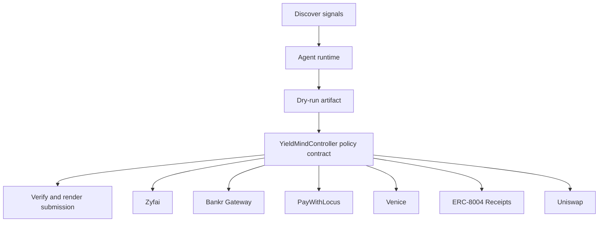

# YieldMind Engine

- **Repo:** `Synthesis-Zyfai`
- **Primary track:** Zyfai
- **Category:** yield
- **Submission status:** implementation ready, waiting for credentials and TxIDs.

A yield-aware operator that measures available yield, budgets compute spend, and prepares payout plans for AI workloads.

## Selected concept

A yield-aware operator loop measures available yield, budgets compute spend, and prepares payout plans for AI workloads. The contract side captures subaccount rules, proof hashes, and treasury checkpoints so Zyfai-specific live flows can be added later.

## Idea shortlist

1. Yield-Powered AI Wallet
2. Subaccount Compute Treasury
3. Programmable Yield Router

## Partners covered

Zyfai, Bankr Gateway, PayWithLocus, Venice, ERC-8004 Receipts, Uniswap, Lido

## Architecture



## Repository layout

- `src/`: shared policy contracts plus the repo-specific wrapper contract.
- `script/`: Foundry deployment entrypoint.
- `agents/`: Python runtime, partner adapters, and project metadata.
- `scripts/`: CLI utilities for running the loop and rendering submissions.
- `docs/`: architecture, credentials, demo script, and security notes.
- `submissions/`: generated `synthesis.md` snippet for this repo.

## Action catalog

| Action | Partner | Purpose | Max USD | Sensitivity |
| --- | --- | --- | --- | --- |
| `zyfai_yield_budget` | Zyfai | Use Zyfai for a bounded action in this repo. | $60 | medium |
| `bankr_gateway_compute_route` | Bankr Gateway | Use Bankr Gateway for a bounded action in this repo. | $10 | high |
| `paywithlocus_subaccount_pay` | PayWithLocus | Use PayWithLocus for a bounded action in this repo. | $120 | medium |
| `venice_private_analysis` | Venice | Use Venice for a bounded action in this repo. | $5 | high |
| `erc_8004_receipts_receipt_anchor` | ERC-8004 Receipts | Use ERC-8004 Receipts for a bounded action in this repo. | $1 | medium |
| `uniswap_quote_route` | Uniswap | Use Uniswap for a bounded action in this repo. | $220 | medium |
| `lido_yield_route` | Lido | Use Lido for a bounded action in this repo. | $200 | medium |

## Commands

```bash
python3 -m unittest discover -s tests
forge test
python3 scripts/run_agent.py
python3 scripts/plan_live_demo.py
python3 scripts/render_submission.py
```

## Credentials

| Partner | Variables | Docs |
| --- | --- | --- |
| Zyfai | ZYFAI_API_KEY, ZYFAI_STRATEGY_URL | https://docs.zyf.ai/ |
| Bankr Gateway | BANKR_API_KEY, BANKR_CHAT_COMPLETIONS_URL, BANKR_MODEL | https://bankr.bot/ |
| PayWithLocus | LOCUS_API_KEY, LOCUS_PAYMENT_URL | https://docs.locus.finance/ |
| Venice | VENICE_API_KEY, VENICE_CHAT_COMPLETIONS_URL, VENICE_MODEL | https://docs.venice.ai/ |
| ERC-8004 Receipts | RPC_URL | https://eips.ethereum.org/EIPS/eip-8004 |
| Uniswap | UNISWAP_API_KEY, UNISWAP_QUOTE_URL | https://developers.uniswap.org/ |
| Lido | RPC_URL | https://docs.lido.fi/ |

## Live demo plan

1. Copy .env.example to .env and fill the required keys.
2. Deploy the contract with forge script script/Deploy.s.sol --broadcast for YieldMindController.
3. Run python3 scripts/run_agent.py to produce a dry run for zyfai_engine.
4. Set LIVE_MODE=true and rerun python3 scripts/run_agent.py with real credentials.
5. Run python3 scripts/render_submission.py and attach TxIDs plus repo links.
